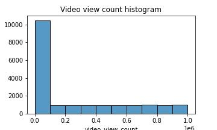
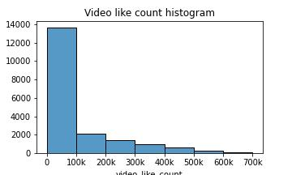
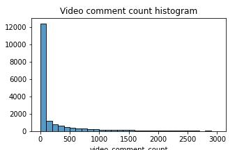
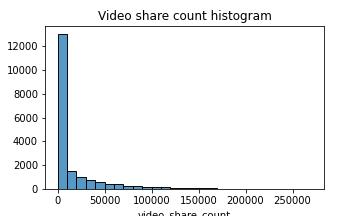
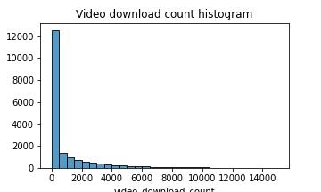

# TikTok Claims Prediction Model
This project's goal is to build a classification model that predicts whether a video is a claim or opinion.
  

# Table of Contents

1. [Exploring the Dataset](#1-|-Exploring-the-Dataset)
1. [Statistical Analysis](#2-|-statistical-analysis)
1. [Building the Model](#3-|-Building-the-Model)
1. [Conclusions](#4-|-conclusions)
1. [Dependencies](#5-|-dependencies)
1. [Author](#6-|-author)
1. [License](#7-|-license)
1. [Acknowledgements](#8-|-acknowledgements)
  

# 1 | Exploring the Dataset
The goal of this first notebook is to explore and understand the 2019 TikTok Claims data aand present our findings.

- Of the 19,382 samples in this dataset, just over 50% (9,608 items) are claims.
- Engagement level is strongly correlated with claim status. This should be a focus of further inquiry.
- Videos with banned authors have significantly higher engagement than videos with active authors. Videos with authors under review fall between these two categories in terms of engagement levels.  

# 2 | Statistical Analysis
The goal of this second notebook is to characterize and clean the 2019 TikTok Claims data set and to create a visualization to share to stakeholders.

- We plot histograms of various metrics of user engagement (views, likes, comments, shares, and downloads) to see the distribution of data.
  

  

### Google Slides EDA presentation link [HERE](https://docs.google.com/presentation/d/1M6YVY6SPIpz14d4j1wdiL_ziZN1wZVp9B1ZU7bfPz5Q/edit?usp=sharing).
  

# 3 | Building the Model
Under Construction. . .
  

## Observations & Patterns
- Over 200 null values were found in 7 different columns. As a result, future modeling should consider the null values to avoid making insights that would assume complete data.

- Video view and like counts are all concentrated on the low end of 1,000 for opinions. Therefore, the data distribution is right-skewed, which will inform the models and model types that will be built.

  

# 4 | Conclusions

As expected, the model . . .
  

# 5 | Dependencies
* python = "^3.10"
* numpy = "^1.25"
* pandas = "^2.0"
* matplotlib = "^3.8.0"
* seaborn = "^0.13.0"
* scikit-learn = "^1.3.1"
  

# 6 | Author
[Ahmed L Rashed](https://ahmedlrashed.github.io)
  

# 7 | License

  

# 8 | Acknowledgements
* [Coursera](https://www.coursera.org/) for hosting the dataset
