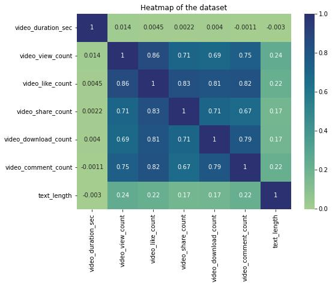
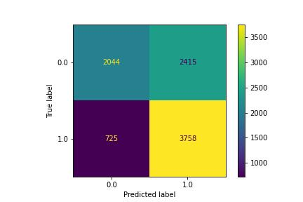

# TikTok Claims Prediction Model
This project's goal is to build a classification model that predicts whether a video is a claim or opinion.
### TLDR Presentation [LINK](https://docs.google.com/presentation/d/1M6YVY6SPIpz14d4j1wdiL_ziZN1wZVp9B1ZU7bfPz5Q/edit?usp=sharing).
  

# Table of Contents

1. [Exploring the Dataset](#1-|-Exploring-the-Dataset)
1. [Statistical Analysis](#2-|-statistical-analysis)
1. [Building the Model](#3-|-Building-the-Model)
1. [Conclusions](#4-|-conclusions)
1. [Dependencies](#5-|-dependencies)
1. [Author](#6-|-author)
1. [License](#7-|-license)
1. [Acknowledgements](#8-|-acknowledgements)
  

# 1 | Exploring the Dataset
The goal of this first notebook is to explore and understand the 2019 TikTok Claims data aand present our findings.

- Of the 19,382 samples in this dataset, just over 50% (9,608 items) are claims.
- Engagement level is strongly correlated with claim status. This should be a focus of further inquiry.
- Videos with banned authors have significantly higher engagement than videos with active authors. Videos with authors under review fall between these two categories in terms of engagement levels.  

# 2 | Statistical Analysis
The goal of this second notebook is to characterize and clean the 2019 TikTok Claims data set and to create a visualization to share to stakeholders.

- We plot histograms of various metrics of user engagement (views, likes, comments, shares, and downloads) to see the distribution of data.
  

  

### EDA Presentation [LINK](https://docs.google.com/presentation/d/1M6YVY6SPIpz14d4j1wdiL_ziZN1wZVp9B1ZU7bfPz5Q/edit?usp=sharing).
  

# 3 | Building the Model
Approximately 94.2% of the dataset represents videos posted by unverified accounts and 5.8% represents videos posted by verified accounts. Since the outcome variable is not very balanced, we use resampling to create class balance in the outcome variable, as needed.

Next, we code a correlation matrix to help determine most correlated variables and plot a heatmap of the data.

The above heatmap shows that the following pair of variables are strongly correlated: `video_view_count` and `video_like_count` (0.86 correlation coefficient).

One of the model assumptions for logistic regression is no severe multicollinearity among the features. To build a logistic regression model that meets this assumption, we should exclude `video_like_count`. Among the variables that quantify video metrics, we could keep `video_view_count`, `video_share_count`, `video_download_count`, and `video_comment_count` as features.

The `claim_status` and `author_ban_status` features are each of data type `object` currently. In order to work with the implementations of models through `sklearn`, we must make these categorical features numeric.

After we split, train, and test our data, we create a confusion matrix to visualize the results of the logistic regression model.

  

## Observations & Patterns
- Over 200 null values were found in 7 different columns. As a result, future modeling should consider the null values to avoid making insights that would assume complete data.

- Video view and like counts are all concentrated on the low end of 1,000 for opinions. Therefore, the data distribution is right-skewed, which will inform the models and model types that will be built.

- A/B Test analysis shows that there is a statistically significant difference in the average view counts between videos from verified accounts and videos from unverified accounts. This suggests there might be fundamental behavioral differences between these two groups of accounts.

- It would be interesting to investigate the root cause of this behavioral difference. For example, do unverified accounts tend to post more clickbait videos? Or are unverified accounts associated with spam bots that help inflate view counts?

- The dataset has a few strongly correlated variables, which might lead to multicollinearity issues when fitting a logistic regression model. We decided to drop video_like_count from the model building.

- Based on the logistic regression model, each additional second of the video is associated with 0.009 increase in the log-odds of the user having a verified status.

- The logistic regression model had not great, but acceptable predictive power: a precision of 61% is less than ideal, but a recall of 84% is very good. Overall accuracy is towards the lower end of what would typically be considered acceptable.

  

# 4 | Conclusions

We developed a logistic regression model for verified status based on video features. The model had decent predictive power. Based on the estimated model coefficients from the logistic regression, longer videos tend to be associated with higher odds of the user being verified. Other video features have small estimated coefficients in the model, so their association with verified status seems to be small.
  

# 5 | Dependencies
* python = "^3.10"
* numpy = "^1.25"
* pandas = "^2.0"
* matplotlib = "^3.8.0"
* seaborn = "^0.13.0"
* scipy = "^1.11.3"
* scikit-learn = "^1.3.1"
  

# 6 | Author
[Ahmed L Rashed](https://ahmedlrashed.github.io)
  

# 7 | License

  

# 8 | Acknowledgements
* [Coursera](https://www.coursera.org/) for hosting the dataset
